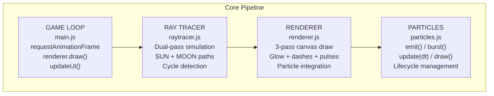
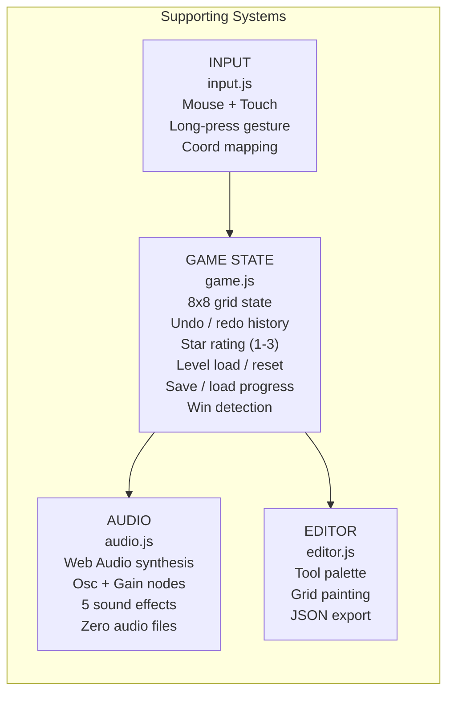
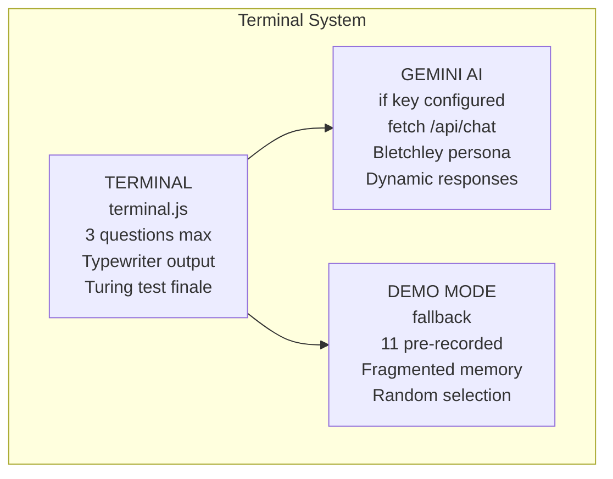
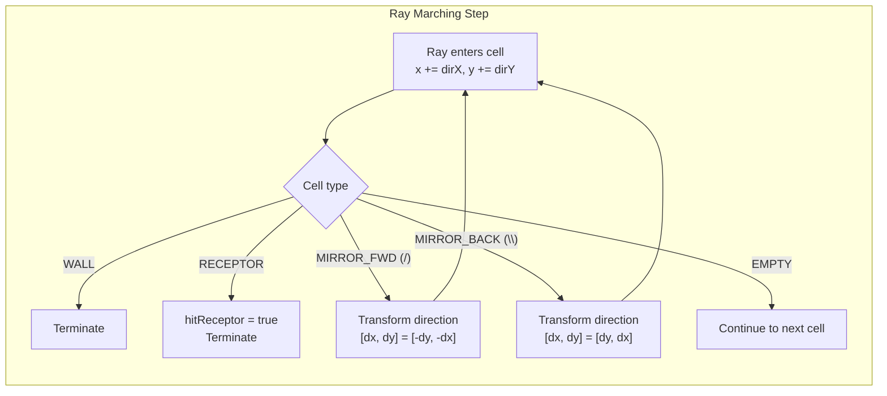
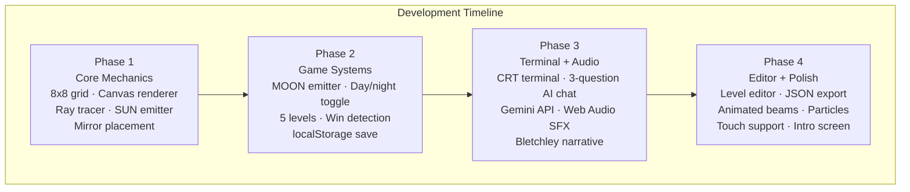
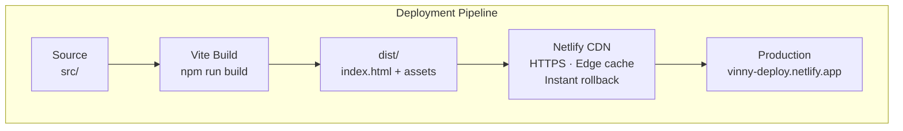

# Solstice

**A light-routing puzzle game with a custom ray-tracing engine, dual-spectrum beam physics, 10 graduated levels, a CRT terminal narrative, undo/redo, and a star-based rating system.**

Built with vanilla JavaScript, rendered on HTML Canvas 2D, with audio synthesis via the Web Audio API and optional AI-powered dialogue through Google Gemini. Deployed as a static site on the Netlify CDN.

**[vinny-deploy.netlify.app](https://vinny-deploy.netlify.app)**

---

## Architecture

Each subsystem is a standalone ES module communicating through a central game state, orchestrated by a `requestAnimationFrame` game loop.

### Core Rendering Pipeline



### Supporting Systems



### Terminal System



---

## Beam Physics

The ray tracer uses grid-based ray marching with cycle detection.



Mirror reflection rules:

| Mirror | Direction in | Direction out |
|--------|-------------|--------------|
| `/`    | Right (1,0)  | Up (0,-1)    |
| `/`    | Down (0,1)   | Left (-1,0)  |
| `/`    | Left (-1,0)  | Down (0,1)   |
| `/`    | Up (0,-1)    | Right (1,0)  |
| `\`    | Right (1,0)  | Down (0,1)   |
| `\`    | Down (0,1)   | Right (1,0)  |
| `\`    | Left (-1,0)  | Up (0,-1)    |
| `\`    | Up (0,-1)    | Left (-1,0)  |

The simulation runs twice per frame — once for SUN mode and once for MOON mode — storing both results independently. Win detection fires when both spectra report a receptor hit, regardless of the active toggle state.

---

## Key Technical Challenges

### Mirrors and Vector Reflection
Each mirror orientation (`/` and `\`) applies a specific transformation to the ray direction vector. The `/` mirror swaps and negates both components (`[dx, dy] → [-dy, -dx]`), while the `\` mirror swaps them without negation (`[dx, dy] → [dy, dx]`). This determines the full 16-state reflection table that governs all beam interactions.

### Cycle Detection in Closed Paths
Mirror arrangements can create infinite loops (e.g., two `/` mirrors facing each other). A visited-set indexed by `x * GRID_SIZE + y` breaks cycles and prevents stack overflow, allowing the tracer to terminate predictably on any arrangement.

### Dual-Pass Simulation
Two complete ray traces execute per frame — one for SUN emitters/receptors, one for MOON. Both results persist in memory simultaneously so the renderer can show the appropriate beam set and detect cross-mode wins. This is not a toggle-switch; the inactive mode's result is still computed for win validation.

### First-Play Demo
On first launch, a brief animated demo plays on level 1. It highlights a cell, places a `\` mirror, and shows the beam reaching the receptor — teaching the core click → place → reflect cycle without text. A `localStorage` flag prevents replay.

### Undo/Redo via Grid Snapshots
The undo system stores full grid snapshots before each mutation. Each snapshot is a deep copy of the 8×8 grid (64 integers). History is truncated on new actions after an undo, and cleared on level load. This keeps the implementation simple — no diffing or inverse operations — at minimal memory cost (~2 KB per 100 snapshots for 64 cells × 4 bytes).

### Star Rating by Par
Each level defines a `par` (minimum mirror count to solve). The player earns 3 stars if their mirror count ≤ par, 2 stars if ≤ par + 2, and 1 star otherwise. The highest star rating achieved per level is persisted in localStorage alongside the solved set.

### Rising-Edge Sound Triggers
Audio effects for receptor activation use a state comparison pattern: `currentLit && !previousLit`. The previous state must update *after* the comparison, not before — a sequence bug that suppresses sound if reversed.

### Responsive Canvas Scaling
The canvas maintains a fixed internal resolution (560×560) while CSS scales it to fill its container. Input coordinates are reverse-mapped by `clientX → (clientX - rect.left) × (internalSize / rect.width)`, preserving pixel-accurate grid hits at any viewport size.

---

## Development Progression

The project evolved across four phases, each building on the previous. Source snapshots for each phase are in the `day1/`–`day4/` directories.



| Phase | Focus | Key Additions | Snapshot |
|-------|-------|---------------|----------|
| **1** | Core Mechanics | Grid, Canvas renderer, ray tracer, SUN emitter, mirror placement (`/` `\`) | (DAY1) |
| **2** | Game Systems | MOON emitter, day/night toggle, 5 levels, win detection, level selector, localStorage | (DAY2) |
| **5** | Level Expansion | 10 levels with graduated difficulty, undo/redo, star rating (1-3), sound settings, first-play demo tutorial | (post-launch) |
| **3** | Terminal + Audio | CRT terminal, Gemini API, 3-question chat, Web Audio synthesis, Bletchley narrative | (DAY3) |
| **4** | Editor + Polish | Level editor, particle system, animated beams, intro screen, touch support, responsive CSS | (DAY4) |

## Technologies

| Layer | Technology |
|-------|-----------|
| Language | Vanilla JavaScript (ES Modules) |
| Rendering | HTML Canvas 2D API |
| Build | Vite |
| Audio | Web Audio API (OscillatorNode + GainNode) |
| AI | Google Gemini API (optional) |
| Hosting | Netlify CDN |
| Persistence | localStorage |

---

## Project Structure

```
├── index.html              Entry point, DOM structure, modal overlays
├── package.json            Vite build configuration
├── vite.config.js
├── src/
│   ├── main.js             Game loop, UI updates, event wiring, win modal, settings
│   ├── game.js             State machine, undo/redo, star rating, level loading, save/load
│   ├── demo.js             First-play tutorial: animates a mirror placement
│   ├── levels.js           Level definitions (build functions)
│   ├── raytracer.js        Ray marching engine, mirror reflection
│   ├── renderer.js         Canvas draw: cells, beams, particles
│   ├── particles.js        Particle system: emit, burst, update, draw
│   ├── input.js            Mouse/touch handlers, coordinate mapping
│   ├── terminal.js         CRT terminal, Gemini API, demo dialogue
│   ├── editor.js           Level editor, tool palette, JSON export
│   ├── audio.js            Web Audio sound synthesis
│   ├── demo.js             First-play animated tutorial
│   ├── constants.js        Enums, colors, grid dimensions
│   └── main.css            Full stylesheet, responsive media queries
└── README.md
```

---

## Deployment



Build produces a versioned bundle with content-hashed assets for cache busting. The site is served over HTTPS with global edge distribution, instant rollback, and zero server-side runtime.

---

## License

Apache 2.0. See [LICENSE](LICENSE).
